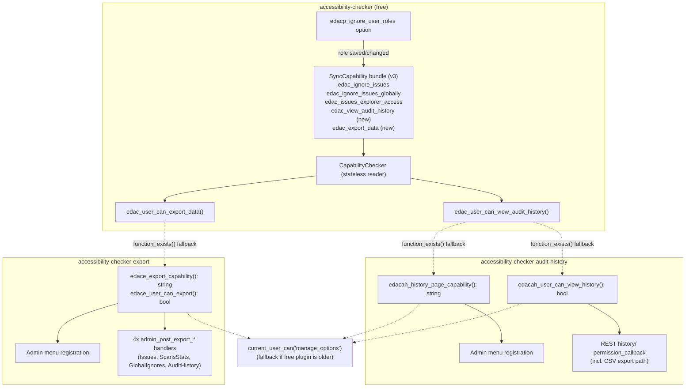

# feat: Extend the ignore-roles capability bundle to Audit History and Export

**Target repos:** `accessibility-checker` (free, capability source of truth), `accessibility-checker-audit-history`, `accessibility-checker-export`
**Type:** feat (with an embedded security fix)
**Depth:** Deep
**Origin:** No upstream brainstorm doc. Grounded in `CAPABILITY_MAP.md` (plugins root) and this session's direct research against current code — several of that doc's status claims are stale and are corrected below (see Key Technical Decision 1).

---

## Summary

Two more plugins in the accessibility-checker family — Audit History and Export — gate their admin pages (and, for Export, four data-export handlers) on a hardcoded `manage_options` check. This plan gives each of them a real, role-configurable capability, sourced from the *same* role-select setting that already grants `edac_ignore_issues` and its siblings, so a site owner manages access from one place. It also fixes a live data-exposure bug in Audit History's REST route (PRO-1150) and, in the same pass, two SQL-injection reports on that identical route (PRO-1148, PRO-1243) — deliberately bundled because separate edits to the same permission_callback would otherwise conflict or reopen each other.

Manual per-user capability assignment (independent of role) is **documentation, not a feature** in this pass — see Key Technical Decision 5.

---

## Problem Frame

`accessibility-checker-pro` already proved out the pattern this plan replicates: a plugin that updates independently of the free plugin can still consume a capability the free plugin owns, by checking for the free plugin's helper function at runtime and falling back to `manage_options` if it isn't there yet. Audit History and Export never got this treatment — they're still on day-one `manage_options` gates, which means every install either grants Editors nothing or grants them everything, with no way to say "these specific people can see the audit trail" or "these specific people can export data."

Separately, Audit History's `history/` REST route checks `current_user_can('read')` — satisfied by every logged-in user down to Subscriber — while its own admin page requires `manage_options`. Any authenticated user can currently pull the full audit history (including CSV export) by hitting the REST route directly, bypassing the page gate entirely. The same route also passes two request parameters (`fields`, `order_by`) unsanitized into SQL identifier positions.

---

## Requirements

- **R1** — Audit History gains a dedicated, role-configurable capability gating both its admin menu and its `history/` REST route (including the CSV export path), sourced from the existing ignore-roles setting.
- **R2** — Export gains a dedicated, role-configurable capability gating its admin menu and all four `admin_post_export_*` handlers, sourced from the same setting.
- **R3** — Both new capabilities degrade gracefully to `manage_options` if the installed free-plugin version predates them (Audit History and Export each update independently).
- **R4** — Audit History's `history/` REST route requires the same capability as the admin page (fixes PRO-1150).
- **R5** — Audit History's `fields` and `order_by` REST parameters are validated against an allowlist before reaching the query builder (fixes PRO-1148, PRO-1243).
- **R6** — Manual per-user capability assignment (independent of role) is documented for site admins/developers, not built as a new UI (per user decision — see KTD 5).

---

## Key Technical Decisions

### KTD1 — `CAPABILITY_MAP.md` is stale on three load-bearing points; code is source of truth

Direct research against the checked-out branch found:
- `SyncCapability` (`accessibility-checker/includes/classes/Capabilities/SyncCapability.php`) **already accepts an array of capability strings**, not just one. The "redesign in progress" the map describes at §9.1a is already shipped.
- The ignore-roles bundle is **already at 3 capabilities**, not 1: `edac_ignore_issues`, `edac_ignore_issues_globally`, `edac_issues_explorer_access`, synced from `edacp_ignore_user_roles` via a single `SyncCapability` instance at version `2` (`includes/options-page.php:42-63`).
- `CapabilityChecker` (`includes/classes/Capabilities/CapabilityChecker.php`) — the stateless read-only wrapper the map describes as "not yet built" — **already exists and is what the bundle's reader functions delegate through.**
- `UserCapabilityGrant` — the map's §9.4 describes this as "already resolved/built" with a full API and a passing test. **It does not exist anywhere in the codebase.** This is a real gap in the map, not a stale-but-harmless claim — it's the reason KTD5 below matters.

This plan builds against the verified current state, not the map's status markers.

### KTD2 — Fold both new capabilities into the existing bundle, not new options

Per explicit direction: whoever a site owner grants access to via the existing `edacp_ignore_user_roles` role-select setting also gets Audit History view access and Export access — one control surface, no new settings UI. Mechanically this is a two-line change: add two more capability strings to the array already passed into `SyncCapability`'s constructor and bump its version.

This does mean the option name (`edacp_ignore_user_roles`, literally "ignore roles") no longer describes everything it grants — `edac_issues_explorer_access` already broke that literal-naming assumption in the prior pass, so this isn't a new precedent, just a continuation of one already accepted.

### KTD3 — New capability names and shape, mirroring the existing bundle members

- `edac_view_audit_history` — gates Audit History's menu + REST route.
- `edac_export_data` — gates Export's menu + all four export handlers.

Both are added to the *same* `SyncCapability` instance and array as the existing three (not a second instance) — `sync()` already loops `capabilities × roles`, so one instance naturally keeps all five capabilities bundled and in sync with each other. Version bumps from `2` to `3`.

Following the existing pattern exactly (`edac_user_can_ignore()`, `edac_user_can_access_issues_explorer()`), the free plugin exposes two new global reader functions backed by `CapabilityChecker`:
- `edac_user_can_view_audit_history(): bool`
- `edac_user_can_export_data(): bool`

### KTD4 — Consumers use the pro-plugin's two-tier `function_exists()` fallback pattern, not a version-string check

`accessibility-checker-pro/includes/options-page.php` already establishes the shape both new consumers should copy — e.g. `edacp_user_can_access_issues_explorer()`:

```php
function edacp_user_can_access_issues_explorer(): bool {
    if ( function_exists( 'edac_user_can_access_issues_explorer' ) ) {
        return edac_user_can_access_issues_explorer();
    }
    return current_user_can( 'manage_options' );
}
```

Audit History and Export each need this shape twice: once returning a **capability string** (for `add_submenu_page()`'s cap argument, which WP core checks internally and which cannot take a boolean), and once returning a **bool** (for REST `permission_callback`s and the `admin_post` handlers, which branch inline). This mirrors the asymmetry the map already documented and confirmed intentional for pro's Issues Explorer (§2.3) — a menu registration needs a raw capability string, a runtime check needs a boolean, and both are correct for their own structural reasons.

Neither Audit History nor Export currently contains any `function_exists('edac_...')` fallback of any kind — this is new code in both, not an extension of existing logic.

### KTD5 — Manual per-user assignment stays documentation-only this pass

Per explicit direction, no new admin UI (profile field or bulk action) is being built. WordPress's own capability model already makes a direct per-user grant (`$user->add_cap( 'edac_view_audit_history' )`) safe to layer on top of `SyncCapability`'s role-level sync with zero code changes — `sync()` only ever touches role objects in `wp_user_roles`; a capability added directly to one user lives in that user's own `wp_capabilities` meta, and `current_user_can()` merges both automatically. Since `UserCapabilityGrant` doesn't exist (KTD1), the documentation this plan produces should show the raw WP mechanism directly (`$user->add_cap()` / `$user->remove_cap()` in a snippet or must-use plugin), not reference a class that isn't there.

### KTD6 — SQL injection fix (PRO-1148/1243) rides along with the REST permission fix (PRO-1150)

Same file, same route, same `permission_callback` under edit for R4 — fixing the two issues in separate passes risks one edit clobbering or re-opening the other. `fields` and `order_by` currently flow unsanitized from `$request` straight into the `stellarwp/db` query builder's `->select()` and `->orderBy()` calls (`app/class-rest-api.php:128-132` → `app/Models/class-accessibility-checker-audit-history.php:122-133`). Both need allowlist validation against the audit-history table's real column set before reaching the model; invalid values should fall back to safe defaults (`fields` → `'*'`, `order_by` → the current default column) rather than erroring, to avoid turning a security fix into a functional regression for any legitimate caller passing slightly-off values.

### KTD7 — No new PHPUnit harness for Export; Audit History gets a minimal one

Neither plugin has a working PHPUnit suite today. Audit History's `composer.json` already declares the full WP test stack as dev dependencies (`phpunit`, `wp-phpunit/wp-phpunit`, `yoast/wp-test-utils`, `brain/monkey`, `mockery`) but has no `phpunit.xml` or bootstrap to use them — standing up the harness there is small (config + bootstrap, modeled on the free plugin's) and directly protects a real security fix (KTD6) with regression coverage. Export has no test dependencies declared at all; building a WP PHPUnit harness from nothing for one boolean-check function is disproportionate to what was asked. Export's verification stays manual/QA-checklist per the same precedent used for the PRO-1239 pass (a written test plan + executed test report, not automated coverage) — captured as an explicit scope call in Scope Boundaries, not a silent gap.

---

## High-Level Technical Design

Capability resolution flow for a request reaching either new gate, showing how the three plugins hand off:



---

## Implementation Units

### U1. Free plugin — extend the capability bundle with two new capabilities

**Goal:** Add `edac_view_audit_history` and `edac_export_data` to the existing `SyncCapability` bundle and expose reader functions for other plugins to consume.

**Requirements:** R1, R2, R3, R6 (foundation for)

**Dependencies:** None — this is the root of the dependency chain.

**Files:**
- `accessibility-checker/includes/options-page.php` — add two capability constants alongside the existing three (`EDAC_CAPABILITY_IGNORE_ISSUES` etc., lines ~25-30); add both to the array passed into `edac_ignore_capability()`'s `SyncCapability` constructor (lines 42-63); bump the version argument from `2` to `3`; add `edac_user_can_view_audit_history(): bool` and `edac_user_can_export_data(): bool`, following the exact shape of `edac_user_can_ignore()` / `edac_user_can_access_issues_explorer()` (lines 68-88), each delegating to `CapabilityChecker::user_can()`.
- `accessibility-checker/tests/phpunit/includes/IgnoreCapabilityTest.php` — extend the bundle-level assertions (`test_sync_grants_all_three_bundled_capabilities` becomes a 5-capability assertion; add `test_new_helper_functions_true_for_synced_role` / `_false_for_unsynced_role` / `_true_for_manage_options_user` coverage for the two new reader functions, mirroring the existing three).

**Approach:** This is additive to an already-generic mechanism — `SyncCapability::sync()` already loops `capabilities × roles`, so widening the array is the entire mechanical change. No change to `SyncCapability.php` itself is needed (verified via KTD1's research: the class already supports N capabilities per instance).

**Patterns to follow:** `edac_ignore_capability()` and its three existing reader functions (`includes/options-page.php:42-88`) are the direct template — new code should be structurally identical, not a new abstraction.

**Test scenarios:**
- Happy path: a role added to `edacp_ignore_user_roles` gains all five capabilities, including the two new ones, in one option save.
- Happy path: `edac_user_can_view_audit_history()` / `edac_user_can_export_data()` return `true` for a user in a synced role, `false` for a user in an unsynced role.
- Edge case: a `manage_options` user returns `true` for both new reader functions even with no role explicitly synced (admin bypass).
- Edge case: removing a role from the option revokes both new capabilities from that role without affecting the other three.
- Regression: the existing three capabilities' behavior is unchanged (existing `IgnoreCapabilityTest` assertions still pass) — the bundle grew, nothing already granted was narrowed.
- Migration: version bump from `2` to `3` triggers exactly one re-sync per site (no duplicate/missing grants), verified the same way `test_version_bump_forces_remigration` already proves this for the class generically.

**Verification:** All `IgnoreCapabilityTest` and `SyncCapabilityTest` assertions pass; a role granted via the existing Settings UI shows the two new capabilities in `current_user_can()` output for a user in that role.

---

### U2. Audit History — wire the new capability into the menu and fix the REST permission gap (PRO-1150)

**Goal:** Replace the hardcoded `manage_options` default and the REST route's `current_user_can('read')` check with the new fallback-aware capability, closing the page/REST mismatch.

**Requirements:** R1, R3, R4

**Dependencies:** U1 (the free-plugin reader functions must exist for the fallback to have something to detect)

**Files:**
- `accessibility-checker-audit-history/app/class-plugin.php` — the `add_submenu_page()` call (lines ~393-412) currently uses `apply_filters('edacah_filter_history_page_visibility_capability', 'manage_options')`; change the filter's **default** argument from the literal `'manage_options'` to the new `edacah_history_page_capability()` helper's return value, preserving the filter itself (existing site customizations via the filter keep working unchanged).
- `accessibility-checker-audit-history/app/class-rest-api.php` — the `history/` route's `permission_callback` (lines 53-68, currently `current_user_can('read')` at line 63) changes to call the new `edacah_user_can_view_history()` boolean helper. This single change also closes the CSV export path (`format=csv` branch inside `get_history()`), since it shares the same route and permission_callback — no separate gate needed there.
- New file, e.g. `accessibility-checker-audit-history/app/Helpers/class-capabilities.php` (or a functions file matching the plugin's existing classmap-autoload convention) — houses `edacah_history_page_capability(): string` and `edacah_user_can_view_history(): bool`, each with the two-tier `function_exists()` fallback from KTD4.
- `accessibility-checker-audit-history/phpunit.xml.dist` and a test bootstrap (new, see U2's role in KTD7) — minimal WP-test harness setup so the tests below can run.
- `accessibility-checker-audit-history/tests/AuditHistoryCapabilityTest.php` (new) — see test scenarios below.

**Approach:** Exact structural mirror of `accessibility-checker-pro/includes/options-page.php`'s `edacp_issues_explorer_capability()` / `edacp_user_can_access_issues_explorer()` pair (KTD4). Note the existing `edacah_filter_history_page_visibility_capability` filter must survive this change untouched — sites that already customized it via that filter should see no behavior change; only the *default* value changes.

**Patterns to follow:** `accessibility-checker-pro/includes/options-page.php:38-71` (both the string-returning and bool-returning fallback functions).

**Test scenarios:**
- Happy path: a user with `edac_view_audit_history` (via role sync) can load the Audit History admin page and successfully call the `history/` REST route.
- Happy path: a `manage_options` admin can always do both, regardless of role sync state (admin bypass, inherited from the bundle).
- **Security regression (this is the PRO-1150 fix):** a logged-in Subscriber (or any role with only `read`, no `edac_view_audit_history`) is rejected by the `history/` REST route, including the `format=csv` branch — confirmed via direct REST call, not just UI navigation.
- Edge case: free plugin present but older than this capability (simulate by making `function_exists('edac_user_can_view_audit_history')` false) — both the menu and REST route fall back to `manage_options`, and an admin is not locked out.
- Edge case: an explicit site customization of `edacah_filter_history_page_visibility_capability` (e.g. a filter forcing `'edit_pages'`) still overrides the new default exactly as it would have overridden the old hardcoded `'manage_options'` default.
- Integration: saving the `edacp_ignore_user_roles` option in the free plugin's Settings UI is reflected in Audit History's REST permission check without requiring a logout/login (matches the live-sync behavior already proven for the other three bundle members).

**Verification:** The security-regression scenario above is the release-blocking check — do not consider this unit done without it passing against a real Subscriber-role test user, not just a mocked capability check.

---

### U3. Audit History — allowlist `fields` and `order_by` on the `history/` route (PRO-1148, PRO-1243)

**Goal:** Close the authenticated SQL injection via unsanitized `fields`/`order_by` REST parameters.

**Requirements:** R5

**Dependencies:** U2 (touches the same route/file; land after the permission fix to avoid two people editing the same `permission_callback` region in parallel, even though this unit's changes are to the callback/model, not the permission_callback itself)

**Files:**
- `accessibility-checker-audit-history/app/class-rest-api.php` — `get_history()` (lines 79-240): validate `fields` (currently read raw at lines 128-132) and `order_by` (currently read raw at lines 116-120) against an allowlist before passing to the model.
- `accessibility-checker-audit-history/app/Models/class-accessibility-checker-audit-history.php` — `get_list()` (lines 97-157): the actual injection point is here (`->select(implode(',', $field_list))` and `->orderBy($order_by, ...)` at lines ~122-133) — this is where the allowlist must actually be enforced, not just at the REST layer, since the model is the trust boundary that matters for a query builder call.
- `accessibility-checker-audit-history/tests/AuditHistoryQueryTest.php` (new) — see test scenarios below.

**Technical design:** *(directional, not implementation-specification)*

```
ALLOWED_COLUMNS = [set of real audit_history table columns]

sanitize_fields(requested):
    if requested == '*': return '*'
    requested_list = normalize_to_array(requested)
    valid = requested_list ∩ ALLOWED_COLUMNS
    return valid if valid not empty else '*'   # never let an all-invalid request silently select nothing

sanitize_order_by(requested):
    return requested if requested in ALLOWED_COLUMNS else DEFAULT_ORDER_COLUMN
```

**Approach:** Enforce the allowlist at the model layer (`get_list()`), not only in `get_history()`'s REST-facing validation — the model is what actually calls into `stellarwp/db`'s query builder, and a defense-in-depth check there protects any future caller of `get_list()`, not just this one REST route. `$page_size`/`$page` should also get an explicit `(int)` cast in the same pass (currently only `is_numeric()`-checked, not cast) — cheap hardening, same file, same risk class.

**Patterns to follow:** No existing allowlist pattern in this codebase to mirror directly (this plugin has no PHPUnit history); use WP core's `array_intersect()` / `in_array()` idioms already used elsewhere in the file for similar param validation (`start_date`/`end_date`'s `is_numeric()` checks are the closest local precedent for "validate before use").

**Test scenarios:**
- Happy path: a request with valid `fields=audit_timestamp,user_id` and `order_by=audit_timestamp` returns the expected filtered/sorted result set.
- Happy path: omitting `fields`/`order_by` entirely still defaults to `'*'` / the existing default column, unchanged from current behavior.
- **Security regression (this is the injection fix):** a request with `order_by` containing a SQL fragment (e.g. a subquery or `; DROP` style payload) is rejected/normalized to the default column, not passed through to the query builder — verify via a captured/logged SQL string, not just an HTTP response code, since the vulnerability is in what SQL gets built.
- Security regression: same for `fields` containing a non-column string (e.g. `*, (SELECT ...)`).
- Edge case: `fields` requested as a mix of valid and invalid column names — valid ones survive, invalid ones are dropped silently (not an error), matching KTD6's fallback-not-fail approach.
- Edge case: `page_size` as a float or oversized string is cast to a sane integer rather than passed through raw to `->limit()`.

**Verification:** Both security-regression scenarios must be checked against the actual generated SQL (e.g. via `getSql()`, which the model already calls), not just the HTTP-level response — the class of bug here is "wrong SQL gets built," which an HTTP-only test can miss if the query builder itself throws or no-ops on malformed input for unrelated reasons.

---

### U4. Export plugin — add capability, wire menu and all four export handlers (PRO-1260)

**Goal:** Replace the hardcoded, redundantly-double-checked `manage_options` gate with the new fallback-aware `edac_export_data` capability, applied consistently across the menu and every data-producing code path.

**Requirements:** R2, R3

**Dependencies:** U1

**Files:**
- `accessibility-checker-export/includes/Backend/Menu.php` — `add_menu_items()` (lines 47-59): replace both the wrapping `if (current_user_can('manage_options'))` and the `add_submenu_page()` capability argument with the new `edace_export_capability(): string` helper's return value (collapses the existing redundant double-check into one call, per CAPABILITY_MAP §5.1/§8.4 item 11's cosmetic note — fixed as a natural side effect, not separately scoped work).
- `accessibility-checker-export/includes/Backend/Exports/Issues.php` (line ~36), `ScansStats.php` (~36), `GlobalIgnores.php` (~35), `AuditHistory.php` (~36) — each currently has an independently copy-pasted `current_user_can('manage_options')` check; replace all four with a call to a new `edace_user_can_export(): bool` helper.
- New file, e.g. `accessibility-checker-export/includes/Common/Capabilities.php` — houses `edace_export_capability(): string` and `edace_user_can_export(): bool`, same two-tier fallback shape as U2's audit-history helpers.

**Approach:** This plugin already force-deactivates itself if `defined('EDAC_VERSION')` is false (`includes/Common/Plugin.php:70-74`), so the free plugin's *presence* is already guaranteed by the time any of this code runs — only the free plugin's *capability-support version* needs the `function_exists()` fallback, not its existence.

Each of the four export handlers implements a shared `ExportInterface` (`includes/Backend/Exports/ExportInterface.php`) but currently duplicates its own capability+nonce check inline rather than going through anything shared — this is the same "10+ copy-pasted inline checks" pattern flagged for the free/pro REST classes in CAPABILITY_MAP §8.4 item 7. Collapsing all four to call one new helper function is a direct, in-scope fix for that duplication (not a separate refactor), since it's the exact code being touched anyway.

**Patterns to follow:** U2's `edacah_history_page_capability()` / `edacah_user_can_view_history()` pair — same shape, different plugin.

**Test scenarios:**
- Happy path: a user with `edac_export_data` (via role sync) can see the Export menu and successfully trigger all four export actions (Issues, ScansStats, GlobalIgnores when pro's Global Ignores is present, AuditHistory when the audit-history plugin is present).
- Happy path: a `manage_options` admin can always do all four, regardless of role sync (admin bypass).
- Security regression: a logged-in user without `edac_export_data` cannot trigger any of the four `admin_post_export_*` actions directly (i.e., hitting `admin-post.php?action=export_issues` with a valid nonce but insufficient capability still `wp_die`s) — this must be checked per-handler since the four are independent entry points, not gated by a shared front door.
- Edge case: free plugin present but older than this capability — menu and all four handlers fall back to `manage_options`, admin not locked out.
- Edge case: the Global Ignores or Audit History export forms/handlers are conditionally registered only when their respective add-on plugins are active (`defined('EDACP_VERSION')` / `defined('EDACAH_VERSION')`) — confirm the new capability check doesn't change that existing conditional registration, only what gates access once registered.

**Verification:** The per-handler security-regression scenario is release-blocking — each of the four `admin_post_export_*` entry points must be independently verified, since a fix applied only to the menu page would leave all four direct-POST paths exploitable (this is exactly the class of bug PRO-1150 was, applied to a different plugin).

---

### U5. Documentation — capability reference and manual per-user grant snippet

**Goal:** Give site admins/developers a clear reference for the (now five) capability strings, how role-based granting works via the existing setting, and how to grant one to an individual user outside of role, per KTD5.

**Requirements:** R6

**Dependencies:** U1, U2, U4 (documents the finished capability set and its consumers)

**Files:**
- `accessibility-checker/docs/capabilities.md` (new, or extend an existing hooks/developer doc if one already serves this purpose — check `docs/hooks.md`, referenced in `CAPABILITY_MAP.md`'s file list, before creating a new file).

**Approach:** Document, per capability: the exact string, what it gates (with plugin name), and how it's granted (the role-select setting, one control surface for all five per KTD2). Include one short code snippet showing the raw WP mechanism for a one-off individual grant (`$user->add_cap( 'edac_view_audit_history' )` in a must-use plugin or `functions.php`-equivalent), with a note that this is a standard WordPress capability and needs no special handling to coexist with the role-level sync (KTD5's coexistence argument, stated plainly for a non-implementer audience). Explicitly do not reference `UserCapabilityGrant` — it doesn't exist (KTD1).

**Test scenarios:** Test expectation: none — this is a documentation unit with no executable behavior.

**Verification:** A developer unfamiliar with this session's work can read the doc and correctly grant `edac_view_audit_history` to one specific user without touching the role-select setting, using only the doc's snippet.

---

## Scope Boundaries

**In scope:** Everything in U1-U5 above — the two new bundled capabilities, their consumption in Audit History and Export, the PRO-1150/1148/1243 fixes, and the documentation deliverable.

### Deferred to Follow-Up Work

- **PRO-1152** (Audit History's unauthenticated `/test` REST route) — same file as U2/U3's changes, genuinely tempting to bundle, but it's a distinct, already-tracked, low-priority ticket with no relationship to the capability or injection fixes. Delete-only change; do it as its own one-line PR rather than inflating this one.
- **A real admin UI for manual per-user grants** (profile field or bulk action) — explicitly descoped to documentation-only this pass per KTD5. If this changes later, it would need `UserCapabilityGrant` (or equivalent) actually built first, which doesn't exist today despite `CAPABILITY_MAP.md` describing it as done.
- **A WP PHPUnit harness for the Export plugin** — per KTD7, disproportionate to what's being changed there; Export's verification stays manual/QA-checklist this pass.
- **Consolidating the four Export handlers' duplicated nonce-check code** beyond the capability-check line itself — U4 touches the capability check specifically; broader dedup of the nonce-verification boilerplate across `ExportInterface` implementers is a separate maintainability cleanup, not required by this plan's requirements.
- **Cross-plugin settings-clone/import sync** (CAPABILITY_MAP §10 item 8 — multisite clone and Export's own import/export round-trip potentially bypassing `SyncCapability`'s option-save hooks) — flagged in the map as needing separate investigation before any fix is designed; out of scope here.

---

## Risks & Dependencies

- **Sequencing risk:** U2 and U3 both touch `app/class-rest-api.php` in the same repo. Land U2 first (permission fix) and U3 second (injection fix) as separate commits/PRs against the same base, not as parallel work, to avoid merge conflicts on the same function.
- **Fallback correctness is the highest-value thing to verify in U2/U4:** if `function_exists()` fallback logic has a bug, the failure mode is either "admin locked out" (bad, visible immediately) or "capability check silently no-ops to allow everyone" (bad, invisible until an incident) — both are covered explicitly in each unit's edge-case test scenarios above, not left implicit.
- **No existing test harness in two of the three repos.** KTD7 already scopes this down for Export; for Audit History, standing up a minimal PHPUnit setup is itself new work with its own risk of taking longer than the capability change it's meant to protect — if it proves more involved than expected, the fallback plan is the same manual QA-checklist approach used for Export and for the PRO-1239 precedent, not silently dropping test coverage for the security fix.
- **`CAPABILITY_MAP.md` itself needs a correction pass** once this plan lands — it will otherwise keep telling future readers that `UserCapabilityGrant` exists and that the bundle redesign is "in progress." Not part of this plan's implementation units, but worth a follow-up note/PR to the doc itself.

---

## Open Questions

- Exact allowlisted column set for U3's `fields`/`order_by` validation — depends on the real audit-history table schema, which wasn't fully enumerated during planning research. Implementer should pull this directly from the table's `CREATE TABLE` definition or the model's own column references before writing the allowlist, not guess from the REST route's usage alone.
- Where exactly the new capability constants/helpers should live within Audit History's classmap-autoloaded (non-PSR-4) structure — a new `app/Helpers/class-capabilities.php` is suggested in U2 but the plugin's existing conventions should be checked at implementation time for a closer-fitting home (e.g. as static methods on an existing class rather than a new file).
